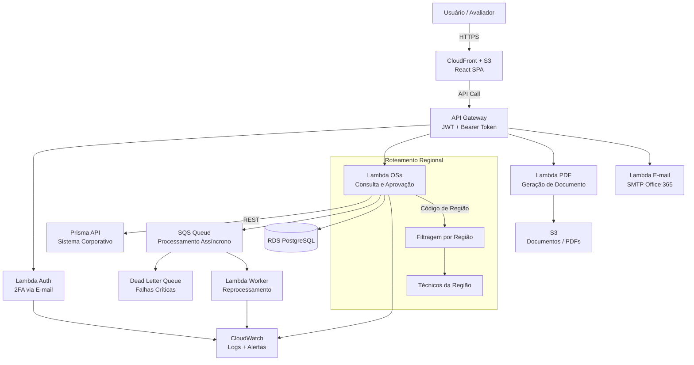
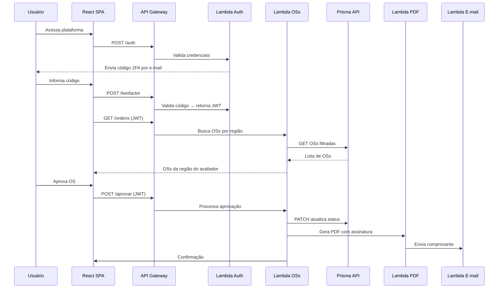

# Serverless OSs Platform

Plataforma serverless full stack para gestão de Ordens de Serviço em operação nacional de grande escala.

> **Nota:** Este repositório documenta a arquitetura e as decisões técnicas de um sistema corporativo em produção.
> O código-fonte não é público por razões de confidencialidade contratual.

---

## Contexto

Uma operação nacional com **400+ pontos de atendimento** precisava digitalizar e automatizar
o processo de consulta, validação e aprovação de Ordens de Serviço — eliminando processos
manuais, reduzindo erros e garantindo rastreabilidade ponta a ponta.

---

## Arquitetura

---

## Fluxo Principal

---

## Stack

| Camada | Tecnologia |
|---|---|
| Frontend | React · JavaScript · JSX · Material UI · React Router |
| Hospedagem | AWS S3 · CloudFront · HTTPS |
| API | AWS API Gateway · JWT · Bearer Token |
| Backend | Python · AWS Lambda · AWS Chalice |
| Autenticação | 2FA via e-mail · JWT com expiração |
| Integração | Prisma REST API · Office 365 SMTP |
| Banco | Amazon RDS PostgreSQL |
| Filas | AWS SQS · Dead Letter Queue · Retry automático |
| Documentos | Geração de PDF · Assinatura digital |
| Observabilidade | AWS CloudWatch · Logs estruturados · Alertas |
| IAM | Policies mínimas por Lambda · Secrets via env |

---

## Decisões Arquiteturais

### ADR-001 — Serverless como arquitetura base
**Problema:** Operação nacional com picos imprevisíveis de uso.
**Decisão:** AWS Lambda + API Gateway — escala automática, custo por execução, zero gerenciamento de servidor.

### ADR-002 — Roteamento regional por código de OS
**Problema:** 400+ lojas em regiões distintas — técnico não deve ver OSs de outras regiões.
**Decisão:** Código de região na OS consumido via Prisma API. Lambda filtra na origem antes de retornar ao frontend.

### ADR-003 — SQS + DLQ para resiliência
**Problema:** OS perdida silenciosamente = técnico que não aparece = SLA quebrado = multa contratual.
**Decisão:** SQS com retry automático + DLQ para falhas críticas + CloudWatch com alerta proativo.

### ADR-004 — 2FA por e-mail
**Problema:** Acesso a dados sensíveis de operação nacional exige segundo fator.
**Decisão:** Código temporário enviado por e-mail via SMTP Office 365, validado antes da emissão do JWT.

---

## Resultados

- ✅ Operação com **400+ pontos de atendimento** digitalizada
- ✅ Zero perda de OS — SQS + DLQ + retry garante resiliência
- ✅ Roteamento automático elimina erro humano de atribuição
- ✅ PDF com assinatura digital gerado automaticamente
- ✅ Rastreabilidade completa via CloudWatch

---

## Minha Atuação

| Área | Responsabilidade |
|---|---|
| Arquitetura | Definição completa — autônoma |
| Frontend | React SPA — autônoma |
| Backend | Todas as Lambdas Python — autônoma |
| Banco | Modelagem RDS PostgreSQL — autônoma |
| Cloud | S3, CloudFront, API GW, SQS, IAM — autônoma |
| Segurança | JWT, 2FA, policies IAM — autônoma |
| Integrações | Prisma API, SMTP, PDF — autônoma |
| Deploy | Chalice + AWS — autônoma |
| Observabilidade | CloudWatch logs + alertas — autônoma |

Projeto construído **do zero, individualmente**, com ownership técnico completo.
